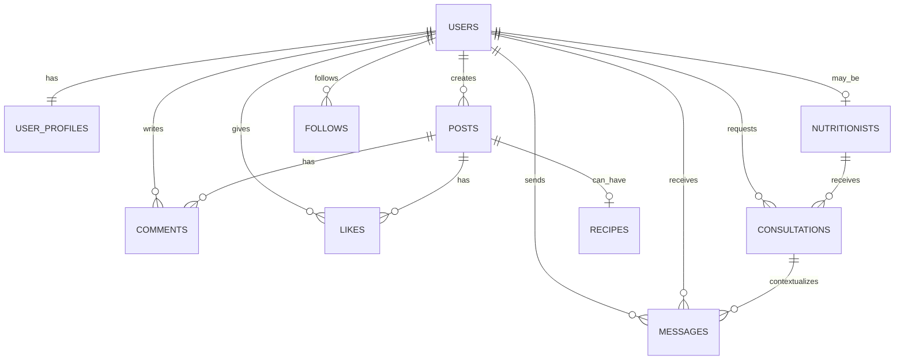

# Banco de dados APTUS

O APTUS utiliza PostgreSQL e foi modelado com **exatamente 10 tabelas funcionais**.

## Tabelas

1. `users` — autenticação, identificação e papel (`user` ou `nutritionist`).
2. `user_profiles` — nome público, bio, objetivo e avatar do usuário.
3. `nutritionists` — registro profissional e dados específicos do nutricionista.
4. `posts` — publicações sociais com legenda e mídia opcional.
5. `comments` — comentários nas publicações.
6. `likes` — curtidas, com unicidade por usuário/publicação.
7. `recipes` — dados de receitas associadas a uma publicação.
8. `follows` — relações de seguidores entre usuários.
9. `consultations` — solicitações e agendamentos entre usuários e nutricionistas.
10. `messages` — mensagens diretas entre usuários, opcionalmente associadas a uma consulta.

## Relacionamentos

### Integridade

- `users.username` e `users.email` são únicos.
- Um perfil é associado a apenas um usuário.
- Um nutricionista possui um registro profissional único.
- Uma publicação pode possuir uma única receita.
- Uma combinação usuário/publicação só pode ter uma curtida.
- Uma combinação seguidor/seguido é única e auto-seguir é bloqueado por constraint.
- Foreign keys usam `CASCADE` ou `SET NULL` conforme o caso.

## Conferência

**TOTAL DE TABELAS: 10.**
